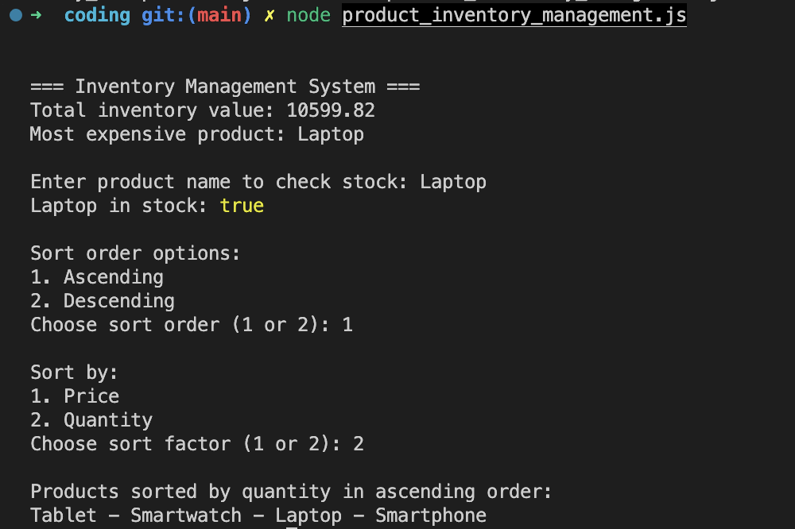

<!-- Name:  Tran Vu Khanh Hung -->
<!-- Email: tvkhung03@gmail.com -->

<!-- Guilde to clone and run -->
# Guilde to clone reposiotry
1. Open your terminal
2. Clone repository : git clone https://github.com/Khanhhungtran23/Online-Test.git
3. You will see 2 folder named coding and Currency_Converter inside Online-Test

# Folder: Currency_Converter - Challenge 1
## Currency Converter for iOS App - Swift

A simple currency converter app built with SwiftUI, allowing users to convert between different currencies with real-time exchange rates.

## Live Demo:
Please view the video demo of Currency_Converter App through this link: https://drive.google.com/file/d/1fnJPW6zBeUwlTmckff11dmC9PVQXVXfk/view?usp=drive_link 

### Application Structure

#### MVVM Architecture
- **Models**: Contains data models
- `Currency.swift`: Model for currency
- `ExchangeRateResponse.swift`: Model for API response
- `NetworkError.swift`: Enum for handling error types
- `FavoritePair.swift`: Model for favorite currency pair

- **ViewModels**:
- `CurrencyViewModel.swift`: Handles currency conversion logic and state management

- **Views**:
- `ContentView.swift`: Main view of the application
- `FavoritePairView.swift`: Component that displays favorite currency pair

- **Services**:
- `ExchangeRateService.swift`: Handles exchange rate API calls

- **Utils**:
- `HapticFeedback.swift`: Utility for haptic feedback
- `UserDefaultsExtension.swift`: Extension for storing local data

### Main features
1. Convert currencies with real-time exchange rates
2. Save favorite currency pairs
3. Haptic feedback for interaction
4. Animation when converting
5. Error handling and validation

### Install and Run

#### Requirements
- Xcode 15.0 or later
- iOS 16.0 or later
- Swift 5.9

#### Installation steps
1. Open the project in Xcode:
```
open Currency_Converter.xcodeproj
```
2. Select the simulator or real device
3. Press Run (⌘ + R) to build and run the app
4. Input value and type of currencies to convert

## Challenges and Solutions

1. Handling API Rate Limit

Challenge: API has a limit on the number of requests
Solution: Implement a rate cache and only update after a period of time

2. Decimals and Format

Challenge: Handling numeric input and formatting the result
Solution: Using NumberFormatter and validation of input

3. State Management

Challenge: Managing complex state with animation and async operations
Solution: Using MVVM and Combine to manage state

4. Error Handling

Challenge: Handling multiple types of errors
Solution: Creating a NetworkError enum and displaying user-friendly errors

# Folder: coding - Challenge 2
<!-- coding challenges -->
## Guide to run
1. You are in folder Online-Test
2. In terminal: 
```bash
cd coding
```
## Product Inventory Management
- Check problems, run this on terminal:
```bash
node product_inventory_management.js
```
- Then following the instruction to choose options in shown in terminal.
- Sample result as image:



## Array Manipulation and Missing Number Problem
- Check problems, run this on terminal to see the result:
```bash
node array_manipulation.js 
```

